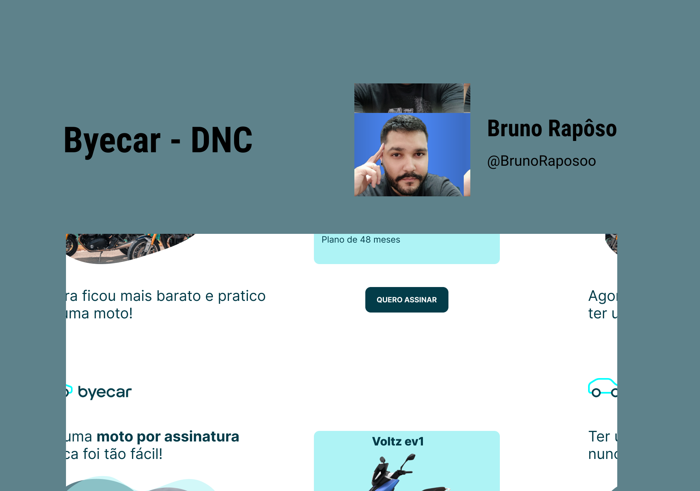

<h1 align="center"> Byecar </h1>

  <a href="#-tecnologias">Tecnologias</a>&nbsp;&nbsp;&nbsp;|&nbsp;&nbsp;&nbsp;
  <a href="#-projeto">Projeto</a>&nbsp;&nbsp;&nbsp;|&nbsp;&nbsp;&nbsp;
  <a href="#-layout">Layout</a>&nbsp;&nbsp;&nbsp

 

  

## 🚀 Tecnologias

Esse projeto foi desenvolvido com as seguintes tecnologias:

- [HTML](https://developer.mozilla.org/pt-BR/docs/Web/HTML)
- [CSS](https://developer.mozilla.org/pt-BR/docs/Learn/Getting_started_with_the_web/CSS_basics)
- [JavaScript](https://www.javascript.com/)

## 💻 Projeto

Projeto desenvolvido para criar uma landing page mostrando novos produtos da byecar

Para acessar o projeto [CLIQUE AQUI](https://majestic-kashata-62a627.netlify.app/)

## 🔖 Layout

Você pode visualizar o layout do projeto através [DESSE LINK](https://www.figma.com/file/rnN5ht6129drtNUS6Q02CO/%5BPPM%5D-Prot%C3%B3tipo-Landing-Page?type=design&node-id=0-1&mode=design&t=wk8LsK2aim5eds2p-0). É necessário ter conta no [Figma](https://figma.com) para acessá-lo.